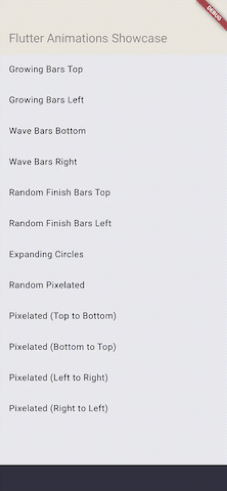

# Animated Transitions

A Flutter package providing a collection of beautiful and smooth transitions for page navigation

## Features

- A set of high-quality page transitions.
- Simple, controller-based animation management.
- Customizable transition duration and behavior.
- Works with the standard Flutter Navigator.




## Usage

To use the page transitions, you can wrap your page route with the `TransitionPageRoute` and provide a transition type.

```dart
import 'package:flutter/material.dart';
import 'package:animated_transitions/animated_transitions.dart';

// ...

Navigator.of(context).push(
  TransitionPageRoute(
    builder: (context) => const NextScreen(),
    transitionAnimation: GrowingBarsTransition(),
  ),
);
```

For more advanced usage and a full list of available transitions, please see the example application in the `/example` directory.
